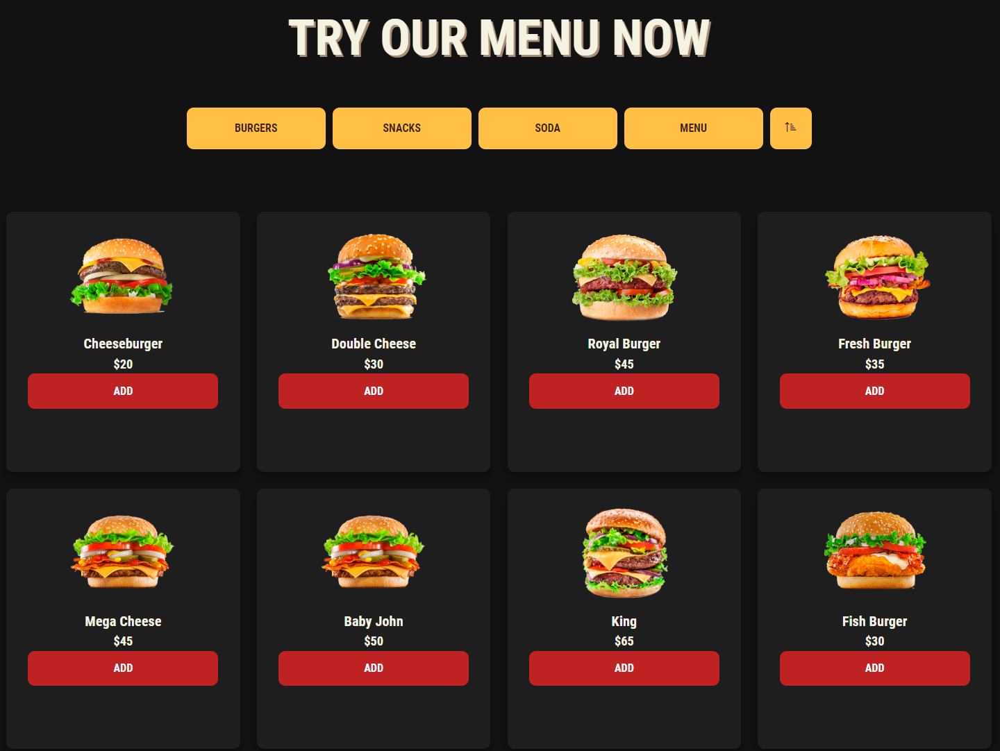
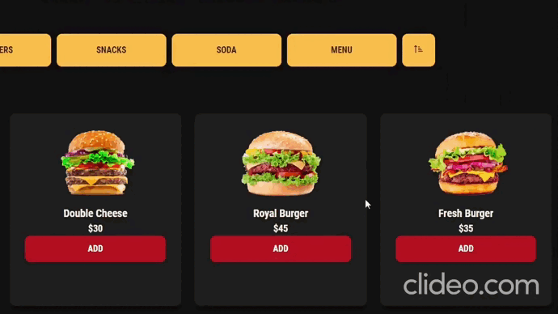
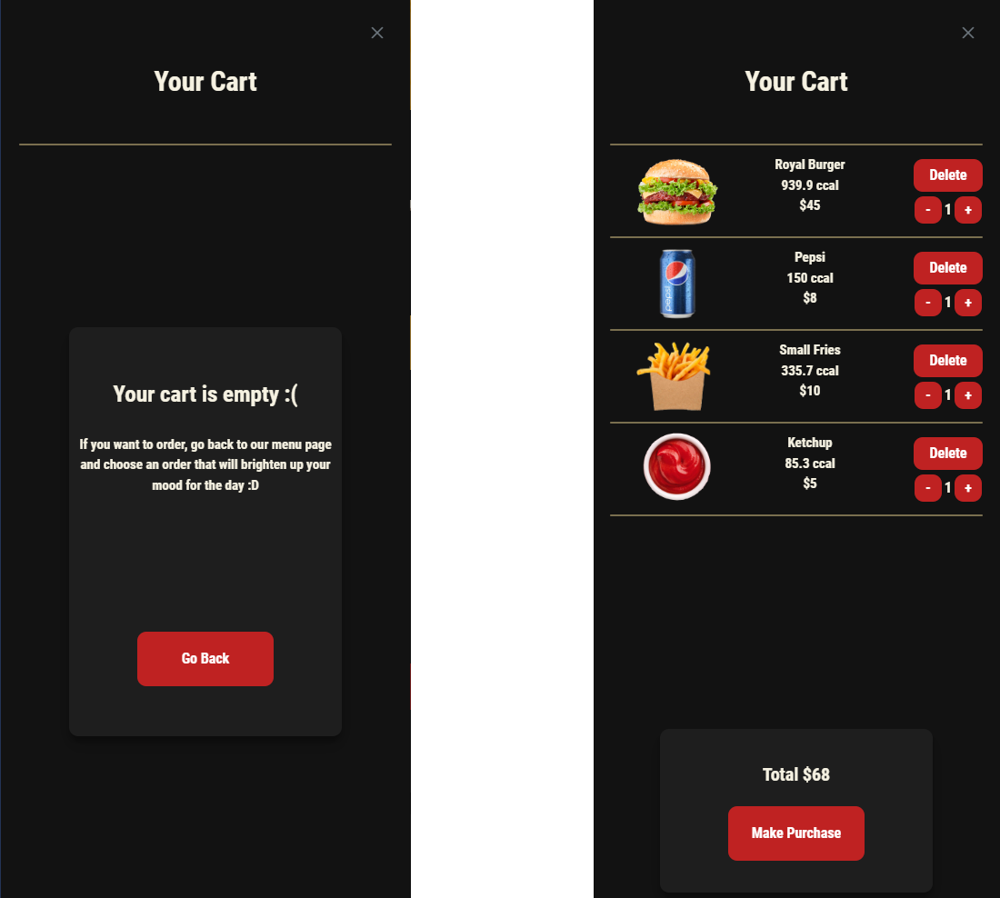
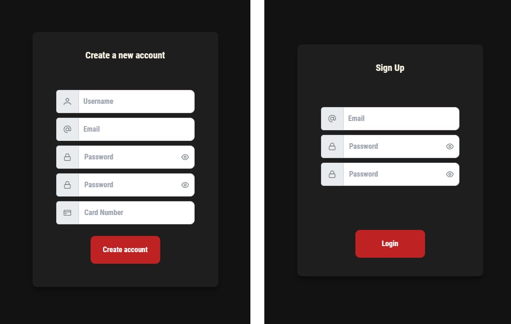
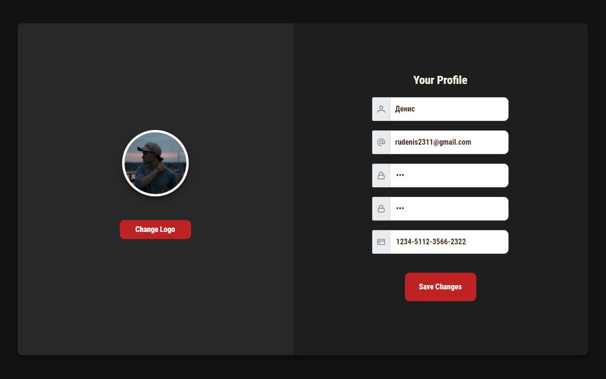
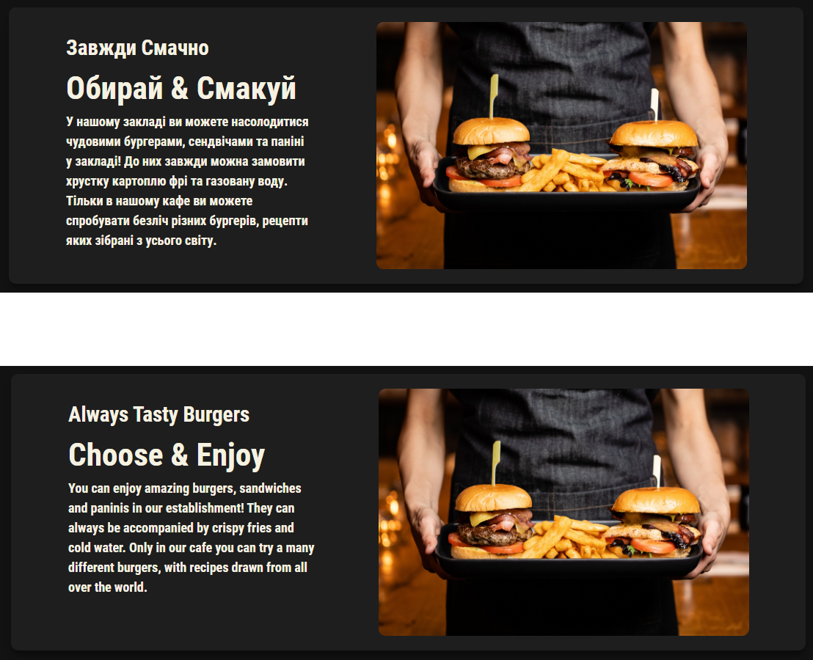

<h1 align="center">Burger Shop</h1>
<h2 align="center">


</h2>

<p align="center">
  


</p>


## Description

**MAKE PURCHASE OF YOUT DREAMS**

<p align="center">
</p>

This site allows you to make remote orders from the cafe. In the picture you can see an example of how the cafe menu is displayed, in addition to the image as you can see the price as well as a button with which you can add items to the cart.

<p align="center">
</p>

## How to buy

### Add to Card and make purchase:-

- **Click** on the Add button.
- **Click** on the cart icon on header to open list of added items 
- Note:- To make purchase you need to be authorized on this web site.

<p align="center">
</p>

## How to authorize

### Registration

- On the registration title you need to complete all field and click on the registration button.
- New user will authomaticaly added to the db.json file and you can login as this user on this web site again.
- 
### Login
- On the login title you need to complete all field and click on the login button.
- Incribed data will compare with data already recorded in the db.json file, and if our data will be similary to current user, you will login the web site.

<p align="center">
</p>

# Edit logined user

### Edit
- On the edit title you need to change values in the right places for you field and click on the save button.
- Incribed data will changed and put in the db.json file.

<p align="center">
</p>

### Change theme
- **Click** on the user icon on header.
- On the user card you can find all buttons that you need. **Click** on the theme change button to change light or dark theme.

<p align="center">
</p>

### Change language
- **Click** on the user icon on header.
- **Click** on the language change button to change English or Ukrainian language.

<p align="center">
</p>

## Project setup

```
npm install
npm run serve
```

On another Terminal call: 

```
json-server --watch db.json
```
